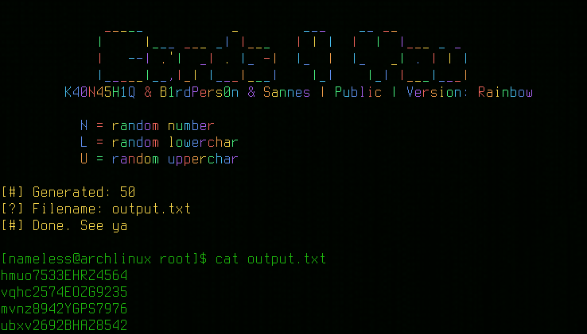

# Project Overview

This program was originally discovered online, decompiled, and thoroughly rewritten to incorporate several significant enhancements. The code has been modernized and optimized to work seamlessly with Python 3.13.

## Key Improvements

- **Compatibility with Python 3.13**: The code has been updated to be fully compatible with Python 3.13. ✅
- **Cross-Platform Screen Clearing**: A universal solution for clearing the screen has been implemented, making it compatible across different operating systems. ✅
- **Object-Oriented Programming (OOP)**: The program has been refactored to follow Object-Oriented principles for better maintainability and readability. ✅
- **Enhanced Color Scheme**: A more vibrant and appealing color scheme has been introduced using ASCII codes. ✅
- **No Dependencies on `colorama`**: The reliance on the `colorama` library has been completely removed, streamlining the code. ✅
- **Intuitive Pattern Indicators**: The symbols used to indicate patterns have been updated to be more intuitive and user-friendly. ✅

